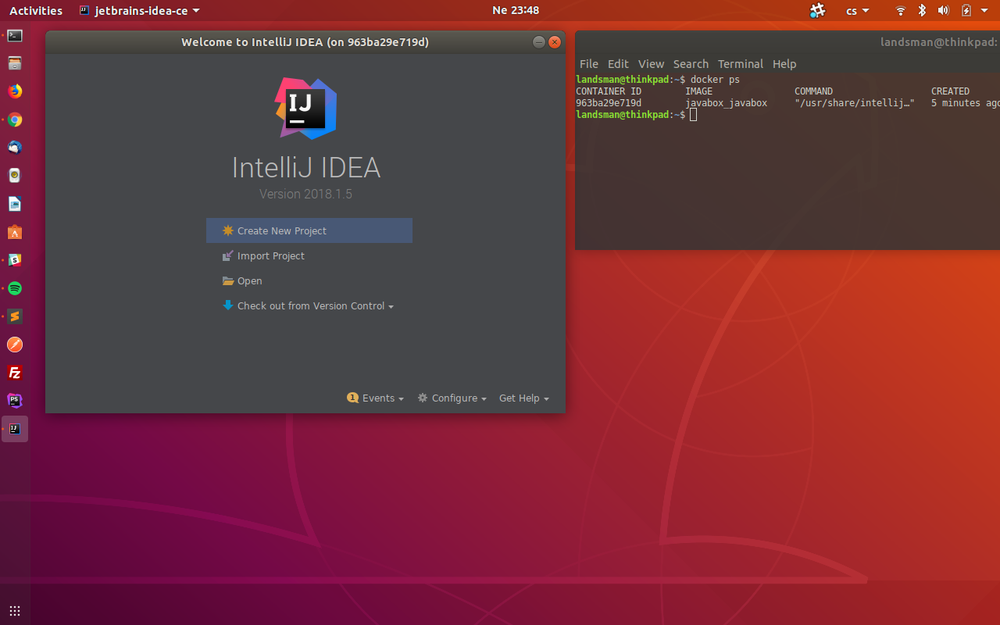

# Don't read me

> ⚠️ **Note:** You can achieve this by using **Devcontainers**.
> See the [documentation](https://www.jetbrains.com/help/idea/connect-to-devcontainer.html). It's a wonderful feature for isolated development environments per project.

So ignore the rest and use devcontainers...



## Start IDE

```
sh start.sh
```

## Notes
- you must have docker, docker-compose
- tested on Ubuntu 18.04
